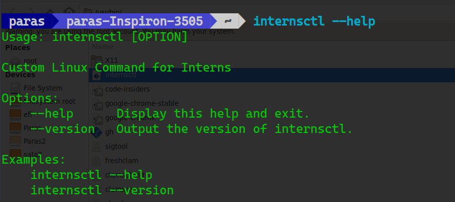
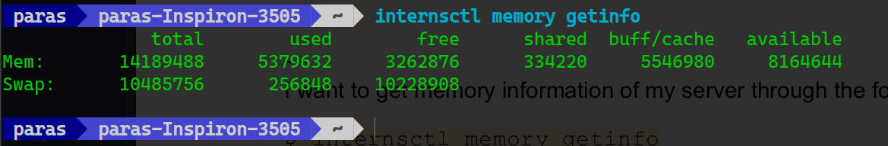
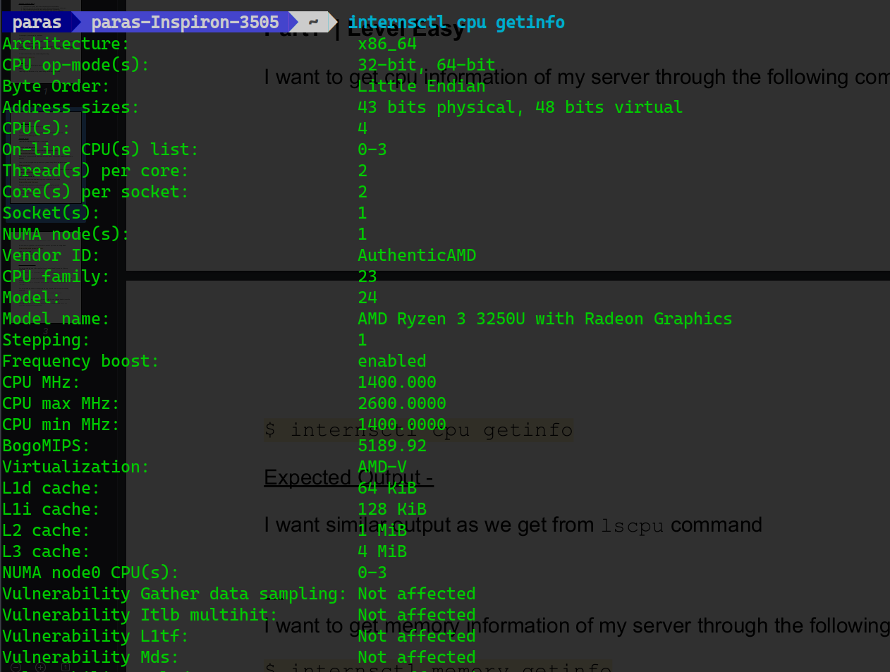
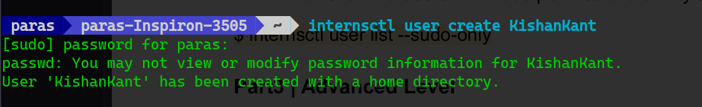
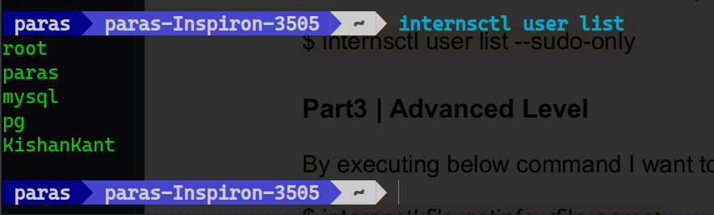
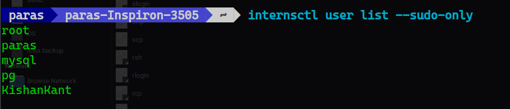
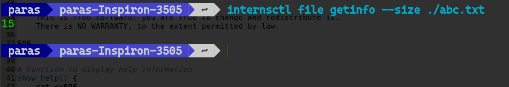
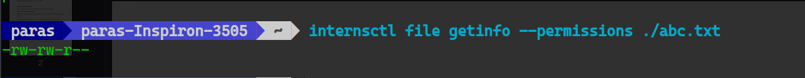
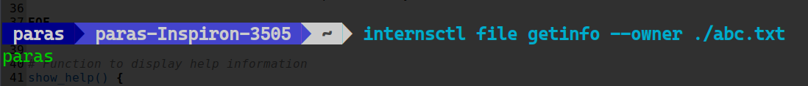
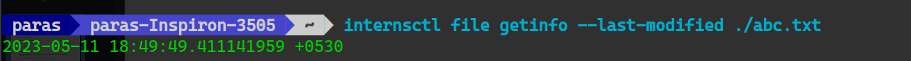

# internsctl - Custom Linux Command for Interns

## Description

`internsctl` is a custom Linux command designed for interns to perform various operations on the system. This script provides functionality related to system information, user management, and file details.

## Usage

1. **Clone the Repository:**
   ```bash
   git clone https://github.com/kks/KishanTask.git
   cd KishanTask
   sudo mv internsctl /usr/bin
   ```

## Options

- `--help`: Display help information and exit.
- `--version`: Output the version of internsctl.
- `cpu`: Display CPU information.
- `memory`: Display memory information.
- `user create <username>`: Create a new user with a home directory.
- `user list`: List all users.
- `user list --sudo-only`: List users with sudo privileges.
- `file [OPTIONS] <file_name>`: Display file information.

## Functionality and Screenshots

###Help

Displays detailed information about how to use the script and exits.

###Version

Shows the current version of the internsctl script.

### CPU Information

Displays details about the CPU configuration.


### Memory Information

Shows information about the system's memory usage.


### User Creation

Illustrates the process of creating a new user with a home directory.


### User List

Lists all users present on the system.


### Sudo Users List

Displays a list of users with sudo privileges.


### File Information

#### File Size

Shows the size of a specified file.


#### File Permissions

Provides information about the permissions of a specified file.


#### File Owner

Displays the owner of a specified file.


#### Last Modified

Shows the last modification timestamp of a specified file.


## Folder Structure

- **screenshots:** Contains screenshots of the script in action.

## Notes

The script has been tested on Ubuntu 20.04.2 LTS.


## Author

- Kishan Kant Sharma
- chintz.7861agchez@gmail.com

Feel free to reach out if you have any questions or issues!
